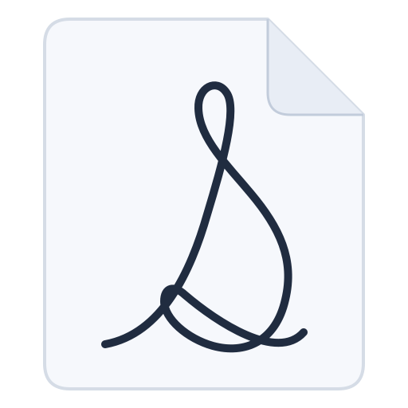
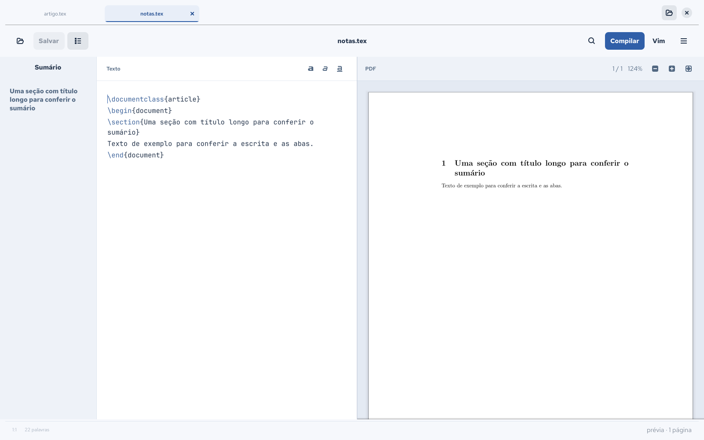
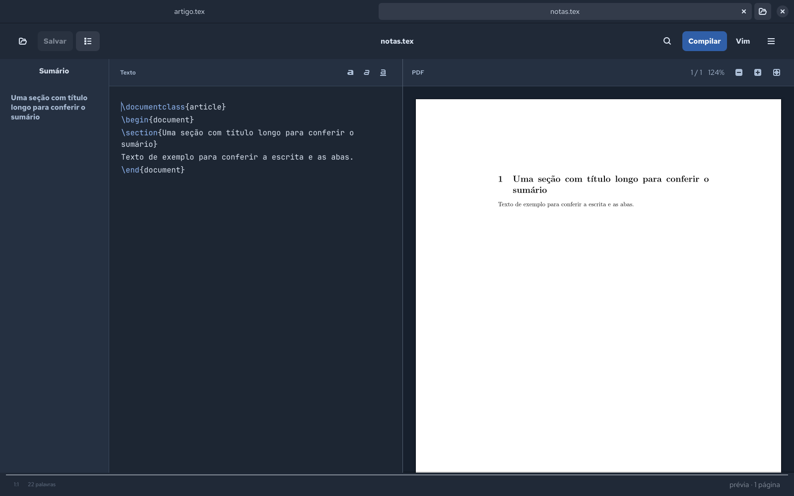

# Serifa



Um editor de LaTeX de mesa, nativo, com preview do PDF ao lado, completação e
modo vim num botão. Abra vários documentos em abas e ajuste o tema, a fonte
e a largura do texto para sua escrita.



<details>
<summary>Ver o tema escuro</summary>



</details>

```sh
bin/serifa                     # abre o último arquivo da sessão anterior
bin/serifa caminho/texto.tex   # abre um arquivo
bin/serifa um.tex outro.tex    # abre os dois em abas
```

## Instalação

O Serifa é uma aplicação Linux. Instale primeiro as bibliotecas gráficas do
sistema e use o Python que tenha acesso a elas. O launcher verifica Python
3.12+, GTK 4.10+, libadwaita 1.5+, GtkSourceView 5, Poppler e Cairo sem abrir
uma janela.

### Ubuntu 24.04

```sh
sudo apt-get update
sudo apt-get install python3 python3-gi python3-gi-cairo \
  gir1.2-gtk-4.0 gir1.2-gtksource-5 gir1.2-adw-1 gir1.2-poppler-0.18 \
  librsvg2-common
```

Os mesmos pacotes gráficos são instalados na CI. As versões necessárias estão
nos repositórios do Ubuntu 24.04: [libadwaita](https://packages.ubuntu.com/noble/gir1.2-adw-1)
e [GtkSourceView](https://packages.ubuntu.com/noble/gir1.2-gtksource-5).

### Fedora

```sh
sudo dnf install python3 python3-gobject python3-cairo \
  gtk4 gtksourceview5 libadwaita poppler-glib
```

Use uma versão do Fedora cujos pacotes atendam aos mínimos acima. Os pacotes
[GtkSourceView](https://packages.fedoraproject.org/pkgs/gtksourceview5/gtksourceview5/)
e [Poppler](https://packages.fedoraproject.org/pkgs/poppler/poppler-glib/)
são distribuídos pelo Fedora; `bin/python --check` verifica a instalação local.

### Baixar e abrir

```sh
git clone https://github.com/playground-vinibispo/serifa.git
cd serifa
bin/python --check
bin/serifa
```

Para compilar PDFs, instale também `latexmk` e TeX. Um documento simples com
pdfLaTeX pode usar:

```sh
# Ubuntu
sudo apt-get install latexmk texlive-latex-base

# Fedora
sudo dnf install latexmk texlive-latex
```

Documentos com fontes, idiomas, imagens ou pacotes adicionais podem exigir
outros pacotes TeX. O editor pode abrir textos sem `latexmk`; a compilação
precisa dessas ferramentas.

O launcher prefere o `.venv` do projeto, depois `/usr/bin/python3` e por fim
`python3` do PATH, usando o primeiro que passa na verificação. Isso evita que
um Python isolado do mise ou pyenv esconda os bindings do sistema. Para escolher
explicitamente um interpretador:

```sh
SERIFA_PYTHON=/caminho/python3 bin/python --check
SERIFA_PYTHON=/caminho/python3 bin/serifa
```

Uma escolha explícita incompatível produz um erro, sem trocar silenciosamente
de interpretador. Se o `.venv` estiver desatualizado, execute `bin/setup`
novamente. Não instale PyGObject pelo pip para compensar bibliotecas do sistema
ausentes.

## Por que GTK4 e não Electron ou Tauri

Um editor de texto é feito de três coisas caras: leiaute de texto, realce de
sintaxe e rasterização de PDF. Aqui as três são C:

- **GtkSourceView 5** é o motor do GNOME Text Editor e do Builder. Traz o realce
  de LaTeX, os snippets, a completação e — o ponto que decidiu a escolha — uma
  **emulação de vim escrita em C** (`GtkSourceVimIMContext`), a mesma do Builder.
  Reimplementar isso em JavaScript seria trocar o certo pelo duvidoso.
- **Poppler** rasteriza o PDF direto em cairo, sem passar por PNG em disco.
- **Python** só amarra os eventos. Nada de laço quente passa por ele.

Tauri poria um WebView entre você e o texto. Se um dia o Python incomodar, o
caminho é gtk-rs: mesmos widgets, mesma aparência, sem trocar de arquitetura.

## Tipografia

Isto não é um editor de código, e por isso não há número de linha, régua de 80
colunas nem realce da linha atual — instrumentos de quem navega por endereço,
não de quem lê um argumento de cem palavras. A coluna de texto tem largura
inicial de 74 caracteres, com margens
recalculadas a cada realocação e quebra por palavra inteira. Fonte inicial:
JetBrains Mono, em 11,5 pt.

O menu **Aparência** permite alternar os temas claro e escuro, aumentar ou
reduzir a fonte e estreitar ou alargar a coluna. Essas preferências são
compartilhadas entre as abas, aplicadas a documentos novos e guardadas para a
próxima sessão. A fonte pode variar de 8 a 24 pt e a coluna de 40 a 100 caracteres.

## O que tem

| | |
|---|---|
| **Abas** | Cada documento mantém seu texto, histórico de desfazer e preview. Abrir novamente um arquivo seleciona a aba existente. `Ctrl+W` fecha a aba; alterações pendentes pedem confirmação. `Ctrl+PageDown` e `Ctrl+PageUp` alternam entre abas. |
| **Modo vim** | Botão `Vim` na barra de título, ou `Ctrl+Alt+V`. A barra de estado mostra o que o vim reporta (`-- INSERT --`, `:w`, `/busca`, e o comando em digitação). O estado fica guardado entre sessões. Com o vim ligado, `Ctrl+B` e `Ctrl+I` são devolvidos a ele. |
| **Text objects no visual** | `vi{`, `va(`, `vi"` e afins, que o GtkSourceView não implementa — ver as armadilhas abaixo. Entende aninhamento e ignora chave escapada (`\{`), que em LaTeX é chave literal. |
| **Preview** | Rolagem contínua, só rasteriza o que está à vista. `Ctrl+scroll` dá zoom, `Ctrl+0` ajusta à largura. A barra do PDF mostra página atual, total de páginas e zoom, com botões para ampliar, reduzir e ajustar à largura. Recompilar **não** joga a rolagem pro topo. |
| **Prévia contínua** | 1,4 s depois de você parar de digitar, **sem tocar no seu arquivo**: o buffer vai para um arquivo sombra no cache e é compilado de lá, com o diretório de trabalho na pasta do texto — é esse detalhe que mantém `\input{../../preambulo.tex}` resolvendo, já que o TeX resolve caminho relativo contra o diretório de trabalho e não contra o arquivo. |
| **Compilação** | `F5` ou `Ctrl+Enter`: grava o seu `.tex` e compila ele mesmo, pelo `scripts/compilar.sh` do projeto quando existe — é ele que sabe nomear o PDF pela pasta. |
| **Salvar** | `Ctrl+S` grava e compila. Nada mais escreve no seu arquivo: gravar é sempre decisão sua. Fechar com alterações pendentes pergunta antes. |
| **Erros** | O `.log` é lido e desdobrado (o TeX quebra as mensagens em 79 colunas). Erros e avisos viram lista; clicar pula pra linha. |
| **Completação geral** | 144 snippets de comandos, letras gregas e ambientes, com tab stops, mais as palavras do documento. É a nativa do GtkSourceView. |
| **Completação por contexto** | Dentro das chaves, um popup próprio: `\cite{` oferece as chaves dos `.bib` com o título ao lado, `\ref{` os `\label` do documento, `\begin{` os ambientes, `\input{` os `.tex` e `\includegraphics{` as imagens. Casamento por subsequência — `eif` acha `einstein_infeld`. Aceitar pula o `}`. |
| **Pares automáticos** | `{`, `[`, `(`, `$` fecham sozinhos com o cursor no meio; `\begin{x}` + Enter escreve o `\end{x}`. Convivem com o vim: em modo normal não há inserção de texto, então nada dispara. |
| **Sumário** | Seções do documento na lateral (`F9`), com títulos longos que quebram linha. A seção atual acompanha o cursor; clicar pula para ela. |
| **Contagem** | Palavras de prosa na barra de estado — comandos, matemática e comentários fora da conta. |
| **Conferidor** | `Ctrl+Shift+C` roda o `scripts/conferir-texto.py` do projeto e mostra o resultado no painel de erros. |
| **Busca** | `Ctrl+F`, com volta ao início. |
| **Arquivo mexido fora** | O arquivo aberto é vigiado. Sem alterações pendentes aqui, o editor recarrega sozinho preservando a posição do cursor. Havendo, aparece um aviso com botão **Recarregar** — nada é sobrescrito sem você mandar. |
| **Sessão** | Último arquivo, modo vim, compilação contínua, posição do divisor e preferências de aparência voltam ao abrir. A lista completa de abas ainda não é restaurada. |

## Atalhos

`Ctrl+O` abrir · `Ctrl+S` salvar e compilar · `Ctrl+Shift+S` salvar como ·
`F5`/`Ctrl+Enter` compilar · `Ctrl+B` negrito · `Ctrl+I` itálico · `Ctrl+F` buscar · `Ctrl+Alt+V` vim · `F9` sumário ·
`Ctrl+Shift+V` preview · `Ctrl+±` zoom do PDF · `Ctrl+0` ajustar à largura ·
`Ctrl+Shift+C` conferir · `Ctrl+W` fechar aba ·
`Ctrl+PageDown`/`Ctrl+PageUp` alternar abas

## Ortografia em português

O corretor depende de `libspelling` e de um dicionário de português instalado
no sistema. Sem eles, a aplicação funciona com a correção desativada.
No Fedora, instale o dicionário com:

```sh
sudo dnf install hunspell-pt
```

Na próxima abertura, o corretor procura `pt_BR`, `pt_PT` ou `pt`, nessa ordem.

## Três armadilhas encontradas no caminho

Ficam registradas porque custaram horas e nenhuma aparece na documentação.

**1. `GtkSourceCompletionProvider` não é implementável em PyGObject.** O par
`populate_async`/`populate_finish` estoura em C. O backtrace do core diz onde:

```
#0  gtk_source_completion_context_set_proposals_for_provider
#1  gtk_source_completion_context_populate_cb      ← callback do GtkSourceView
#2..#10 pygi_closure / ffi                         ← o populate_finish em Python
#11 g_task_return_now
```

O `populate_cb` recebe um `result` que não é a GTask — daí os dois
`g_task_get_source_object: assertion 'G_IS_TASK (task)' failed` que aparecem
antes do estouro — e um `user_data` corrompido. A causa é o binding não ter como
repassar o `user_data` original de um `GAsyncReadyCallback` que chega por vfunc.
Acontece num provedor mínimo de três itens fixos, completando a task na hora ou
num idle, devolvendo valor ou booleano, com ou sem referência viva para a GTask.
Não há como contornar do lado Python.

Por isso a completação por contexto é um `Gtk.Popover` próprio, em
`serifa/context.py`. Custou mais código e deu de volta o que o provedor daria —
com uma vantagem: controlando a inserção, chaves como `einstein_infeld` não
dependem do que o scanner de palavras do `GtkSourceCompletionWords` considera
uma palavra.

**2. O `snippets.rng` do GtkSourceView mente.** O parser real:

- **exige** `_group`, `_name`, `_description` com underscore, e rejeita as
  formas sem;
- **rejeita** o atributo `version`, que o RNG declara obrigatório;
- **exige** `languages` no `<text>`, que o RNG declara opcional.

Errar qualquer um desses dá um `WARNING` no console e zero snippets carregados,
sem mais explicação. Por isso o `.snippets` é gerado em tempo de execução a
partir das listas em `serifa/complete.py`: uma fonte de verdade só.

**3. O modo visual do GtkSourceView não tem text objects.** Os símbolos da
biblioteca dizem isso sem rodeios: existem `gtk_source_vim_command_set_text_object`
e `gtk_source_vim_insert_set_text_object`, mas o estado visual só expõe `clone`,
`get_bounds`, `ignore_command`, `new` e `warp`. Por isso `ci{` funciona e `vi{`
não — ali o `i` é ignorado e o `{` vira o movimento "parágrafo anterior", que
apenas pula o cursor.

`serifa/blocks.py` implementa a delimitação, e `Editor.handle_key` — chamado
pelo controlador que a janela instala em si mesma — reconhece a sequência
`v` → `i`/`a` → sinal. O `v` segue para o vim, que entra em modo visual de
verdade; o `i` e o sinal são consumidos antes do filtro.

## Contribuir

Código, documentação, relatos de bugs e testes em outras distribuições são
bem-vindos. Veja o [guia de contribuição](CONTRIBUTING.md) para preparar o
ambiente, escolher onde mexer e abrir um PR com as verificações necessárias.

## Desenvolvimento

Os comandos de desenvolvimento usam nomes e opções em inglês. Os antigos
`bin/preparar`, `bin/conferir`, `bin/testes`, `bin/instalar-hooks` e
`bin/diagnostico-vim` foram substituídos por `bin/setup`, `bin/lint`, `bin/test`,
`bin/install-hooks` e `bin/debug-vim`. As opções agora são `--coverage` e
`--show-windows`; atualize seus aliases ou automações locais.

Instale [uv](https://docs.astral.sh/uv/getting-started/installation/) e as
bibliotecas gráficas descritas em **Instalação**, depois execute:

```sh
bin/setup            # prepara .venv com as versões do uv.lock
bin/lint             # ruff, o mesmo que a CI roda
bin/test             # a suíte
bin/test --coverage
bin/install-hooks    # opcional: pre-push roda os dois
```

Se tiver GNU Make instalado, os atalhos equivalentes são `make setup`,
`make doctor`, `make run`, `make lint`, `make test`, `make coverage` e
`make install-hooks`. `make check` executa lint e depois a suíte, interrompendo
se algum comando falhar. `make` ou `make help` lista os comandos. Make é
opcional; use diretamente `bin/test` para passar opções ou selecionar módulos.

O `bin/setup` seleciona um Python compatível fora do `.venv`, prepara o
ambiente com `--system-site-packages` e sincroniza Ruff e coverage com
`uv sync --locked`. Assim os bindings GObject continuam vindo do sistema e
as ferramentas de desenvolvimento seguem as versões do `uv.lock`. A
preparação pode ser repetida sem apagar o `.venv` inteiro.

Para atualizar deliberadamente as ferramentas, use `uv lock --upgrade` e
revise a alteração de `uv.lock` antes de rodar `bin/setup` novamente.

A CI roda os dois em cada push e PR. Os testes que precisam de `latexmk` se
pulam sozinhos, para não baixar um texlive inteiro no runner; os de janela
rodam sob Xvfb, porque o GTK4 não tem backend offscreen.

Use `bin/test --coverage` para obter os números atuais. Os testes do preview
incluem navegação entre páginas e renderização depois da rolagem; a aparência
final também precisa de inspeção visual.

Para diagnosticar o modo Vim, use `bin/debug-vim minimal`, `popup`, `editor`
ou `window`; `bin/debug-vim --help` lista os cenários.

## Testes

```sh
bin/test                    # tudo
bin/test -v                 # verboso
bin/test tests.test_blocks  # um módulo
```

A suíte usa `unittest` da biblioteca padrão no Python com acesso ao `gi` e às
bibliotecas gráficas do sistema. A duração depende do backend gráfico e das
ferramentas de compilação disponíveis.

O que os torna rápidos é não precisarem de `app.run()`: basta registrar a
aplicação, montar a janela, chamar `present()` e bombear o laço principal à
mão (`tests/support.py`). Nada toca em arquivo seu — cada caso ganha uma pasta
temporária, e o estado de sessão é desviado para lá.

Quando há `mutter` instalado, o `bin/test` abre as janelas num mutter
headless próprio, com D-Bus próprio: nada aparece na sua tela nem rouba o foco
enquanto a suíte roda. `bin/test --show-windows` roda na sessão atual, para ver.
Na CI, sem mutter, quem dá o servidor gráfico é o `xvfb-run`. Os testes
gráficos se pulam sozinhos quando não há servidor gráfico nenhum.

Se o backend gráfico escolhido pelo ambiente não funcionar com o mutter
headless, execute explicitamente com Wayland e renderização Cairo:

```sh
GDK_BACKEND=wayland GSK_RENDERER=cairo bin/test
```

Vale dizer o que cada grupo guarda, porque quase todos nasceram de um bug que
já aconteceu:

| arquivo | o que protege |
|---|---|
| `test_blocks` | delimitação de `vi{`, com aninhamento e chave escapada do LaTeX |
| `test_context` | os seis contextos de completação, e o `.bib` lido de pastas acima |
| `test_build` | o desdobramento das 79 colunas do TeX e o número de linha dos avisos |
| `test_complete` | que o parser de snippets aceita o XML — errar é silencioso |
| `test_editor` | pares automáticos, contagem de prosa, `overwrite` do modo normal |
| `test_keys` | o Shift no meio de `vi{`, e que o balão nunca desliga o vim |
| `test_appearance` | que o mobiliário de código não volta, e a medida da coluna |
| `test_document` | o arquivo aberto, sem janela: gravar, recarregar, conflito |
| `test_file_lifecycle` | **digitar não grava**, a sombra fora do projeto, a guarda ao trocar |
| `test_formatting` | envoltórios, aceleradores cedendo ao vim, balão só por edição |
| `test_multiple_documents` | abertura de todos os arquivos solicitados e criação da aba inicial |
| `test_tabs` | documentos independentes, ações da aba ativa, fechamento e aparência compartilhada |
| `test_preview_scroll` | redesenho das páginas ao rolar e atualização da prévia ao abrir |
| `test_visual_workflow` | controles de aparência, sumário, indicadores do PDF e persistência |
| `test_runtime` | erros de dependências e respeito ao interpretador escolhido explicitamente |
| `test_test_runner` | opções de cobertura, seleção de módulos e propagação de falhas |

## Estrutura

```
serifa/
├── document.py   ler, gravar, alterações pendentes e vigia do disco
├── editor.py     GtkSource.View, vim, pares automáticos, ortografia
├── formatting.py envoltórios de formatação e a tabela que os descreve
├── session.py    estado guardado entre sessões
├── appearance.py temas, tipografia e medida da coluna
├── blocks.py     delimitação de blocos no modo visual
├── preview.py    Poppler + cairo, rolagem, zoom e indicadores do PDF
├── build.py      latexmk assíncrono e leitura do .log
├── complete.py   geração dos snippets
├── context.py    completação por contexto: detecção, acervo e popup
├── window.py     interface, ações e ciclo de vida de um documento
├── workspace.py  janela com abas e preferências compartilhadas
├── main.py       Adw.Application e abertura de arquivos
└── data/styles/  esquemas de sintaxe claro e escuro
```

## Requisitos

Veja **Instalação** para os pacotes por distribuição e `bin/python --check`
para verificar o interpretador e as bibliotecas locais. `libspelling` e um
dicionário de português são opcionais; a aplicação funciona sem corretor.
O desenvolvimento usa `uv`, Ruff e coverage, com versões em `uv.lock`.

## Licença

O Serifa é distribuído sob a **GNU General Public License, versão 3 apenas**
(`GPL-3.0-only`). Veja o texto integral em [LICENSE](LICENSE).

A licença permite uso comercial e venda de cópias. Ao distribuir o Serifa ou
uma versão derivada, é necessário cumprir a GPLv3, incluindo disponibilizar
o código-fonte correspondente e preservar os direitos dos destinatários de
modificar e redistribuir. Saiba mais na
[FAQ oficial da GNU](https://www.gnu.org/licenses/gpl-faq.html#DoesTheGPLAllowMoney).

Copyright (C) 2026 Vinícius Bispo e colaboradores.

Este programa é software livre: você pode redistribuí-lo e/ou modificá-lo sob
os termos da GNU General Public License, versão 3, publicada pela Free Software
Foundation. É distribuído na esperança de ser útil, mas **sem qualquer garantia**,
inclusive garantias implícitas de comercialização ou adequação a um propósito
específico. Consulte a licença para os termos completos.

A licença do editor não altera a licença dos documentos LaTeX ou PDFs que você
cria com ele.
